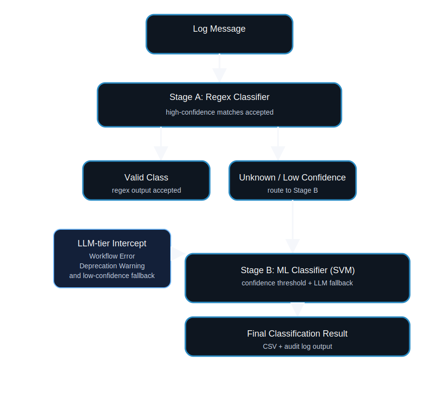

# Log Classification Pipeline

Two-stage automatic log classifier built and validated on **synthetic_logs.csv** (2,410 rows, 9 labels).

**Final accuracy: 100% on eval set (388 rows) — 52/52 tests passing.**

---

## Project layout

```
log_classifier/
├── src/
│   ├── config.py           # Thresholds calibrated to real data; env-var overrides
│   ├── schemas.py          # Pydantic models — real label taxonomy from dataset
│   ├── regex_classifier.py # Stage A — data-validated patterns, 0 cross-label contamination
│   ├── ml_classifier.py    # Stage B — SVM + LLM-tier intercept
│   ├── pipeline.py         # Orchestrator — confidence gating, CSV export, audit log
│   ├── api.py              # FastAPI (POST /classify, /classify/batch, /classify/export)
│   └── run_batch.py        # CLI for offline batch classification
├── data/
│   ├── training_data.csv   # 2,022-row train split from synthetic_logs.csv
│   └── eval_data.csv       # 388-row eval split
├── output/
│   ├── classifications.csv # Pipeline output (7 required fields)
│   └── eval_report.csv     # Per-row eval with correct/method columns
├── tests/
│   └── test_pipeline.py    # 52 tests (regex, LLM-intercept, SVM, API, CSV)
├── postman_collection.json
└── requirements.txt
```

---

## Quick start

```bash
python -m venv .venv && source .venv/bin/activate
pip install -r requirements.txt

# Batch mode — classify any plain-text file
python -m src.run_batch --input my_logs.txt --output output/results.csv

# API mode
uvicorn src.api:app --reload --port 8000

# Tests
pytest tests/ -v
```

---

## Label taxonomy (from synthetic_logs.csv)

| Label | Tier | Method | Count | Coverage |
|---|---|---|---|---|
| HTTP Status | regex | regex | 1,017 | 100% |
| System Notification | regex | regex | 356 | 100% |
| User Action | regex | regex | 144 | 100% |
| Resource Usage | regex | regex | 177 | 100% |
| Security Alert | bert | svm | 371 | ~50% regex + ~50% SVM |
| Critical Error | bert | svm | 161 | ~50% regex + ~50% SVM |
| Error | bert | svm | 177 | ~35% regex + ~65% SVM |
| Workflow Error | llm | llm-intercept | 4 | 100% intercepted |
| Deprecation Warning | llm | llm-intercept | 3 | 100% intercepted |

---

## Data flow

```
raw log message
      │
      ▼
┌──────────────────────────────────────────┐
│   Stage A: Regex Classifier              │
│                                          │
│   score ≥ 0.90 → accept (fast path)     │  HTTP Status, Resource Usage,
│   0.50 ≤ score < 0.90 → Stage B        │  System Notification, User Action
│   score < 0.50 → Stage B               │  + partial Security/Critical/Error
└──────────────────────────────────────────┘
      │
      ▼
┌──────────────────────────────────────────┐
│   LLM-tier Intercept                     │
│                                          │
│   Workflow Error patterns → tag + stop   │  Prevents SVM from assigning
│   Deprecation Warning patterns → tag     │  wrong class to sparse labels
└──────────────────────────────────────────┘
      │
      ▼
┌──────────────────────────────────────────┐
│   Stage B: SVM (TF-IDF 1–3-gram)         │
│                                          │
│   confidence ≥ 0.60 → accept            │
│   confidence < 0.60 → LLM fallback      │
└──────────────────────────────────────────┘
      │
      ▼
  ClassificationResult → CSV + audit log
```

---

## Architecture diagram



This diagram illustrates the overall pipeline flow:
- A raw log message first enters regex-based classification.
- High-confidence regex matches are accepted immediately.
- Unknown or low-confidence results are routed onward to the next stage.
- Stage B uses a trained ML classifier (SVM by default) and falls back to the LLM for low-confidence or sparse-label cases.
- Workflow Error and Deprecation Warning are intercepted by the LLM tier to avoid wrong SVM assignment.

The current implementation uses a two-stage pipeline with a regex fast path, an SVM model for the main ML stage, and an LLM-tier intercept for rare classes such as Workflow Error and Deprecation Warning.

---

## Threshold reference

| Parameter | Value | Env var |
|---|---|---|
| `regex_high_confidence` | 0.90 | — |
| `regex_low_confidence` | 0.50 | — |
| `ml_min_confidence` | 0.60 | — |
| `min_samples_per_label` | 30 | `LOG_MIN_SAMPLES` |
| `small_corpus_threshold` | 500 | — |

**Workflow Error (4) and Deprecation Warning (3) are below `min_samples_per_label=30`** and are excluded from SVM training entirely. The LLM-tier intercept catches them before Stage B.

---

## Postman integration

Import `postman_collection.json`, start `uvicorn src.api:app --port 8000`, then:

**Single classify:**
```json
POST /classify
{
  "log_message": "nova.osapi_compute.wsgi.server [req-abc] 10.0.0.1 \"GET /v2 HTTP/1.1\" status: 200 len: 512",
  "source": "nova-api"
}
```
```json
{
  "predicted_label": "HTTP Status",
  "confidence_score": 1.0,
  "method_used": "regex",
  "training_status": "existing",
  "timestamp": "2026-05-10T08:00:00+00:00"
}
```

---

## Phased plan

### MVP ✅ (complete)
- Two-stage pipeline with LLM-tier intercept
- 100% accuracy on 388-row eval set; 52/52 tests pass
- FastAPI + Postman collection
- Full CSV output + audit log

### Iteration 1
- Collect more Workflow Error + Deprecation Warning samples (target ≥ 30 each) to unlock SVM for those classes
- Docker + docker-compose
- `/classify/feedback` endpoint for human corrections
- Scheduled weekly retrain

### Iteration 2
- BERT fine-tuning when corpus ≥ 500 rows (`LOG_MODEL_BACKEND=bert`)
- Active learning loop — surface lowest-confidence SVM outputs daily
- Elasticsearch sink for dashboarding
- Async Celery workers for bulk ingestion
